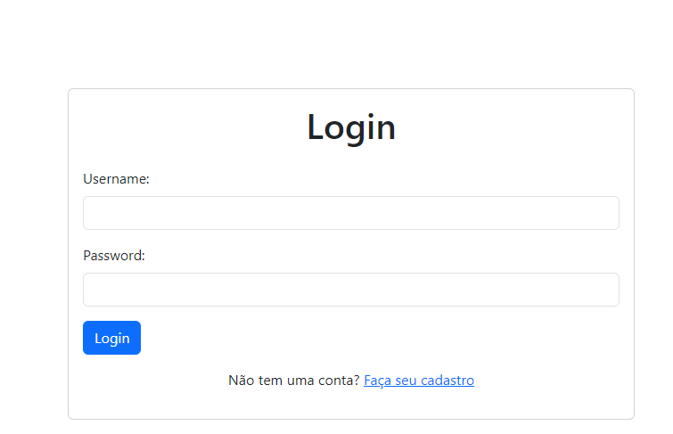
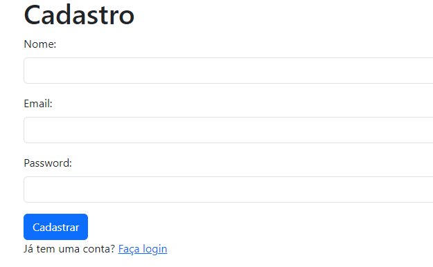

# Projeto de Login

Este projeto inclui um sistema de login para garantir que apenas usuários autorizados tenham acesso às funcionalidades do sistema. O sistema de login inclui:

Autenticação de Usuário: Os usuários podem fazer login fornecendo suas credenciais (email e senha).
Proteção de Rotas: As rotas relacionadas ao cadastro, atualização, remoção e visualização de equipamentos e setores estarão protegidas, exigindo autenticação para acesso.

# Tecnologias Utilizadas

### FRONTEND

Tecnologias Utilizadas no Frontend:
HTML, CSS, JavaScript e Bootstrap foram usados como base para construção da interface do usuário.

### BACKEND

Node: Ambiente de execução JavaScript do lado do servidor.
Express: Framework para construção de aplicativos web em Node.js.
PostgreSQL: Banco de dados relacional para armazenamento persistente dos dados.
TypeORM: Biblioteca de ORM (Object-Relational Mapping) para Node.js e TypeScript, utilizada para mapeamento de objetos em bancos de dados relacionais.
jsonwebtoken: Biblioteca para geração e verificação de tokens de autenticação em aplicações web.
bcrypt: Biblioteca para hash de senhas em aplicações web, utilizado para proteger as senhas dos usuários armazenadas no banco de dados.

## Formulários

